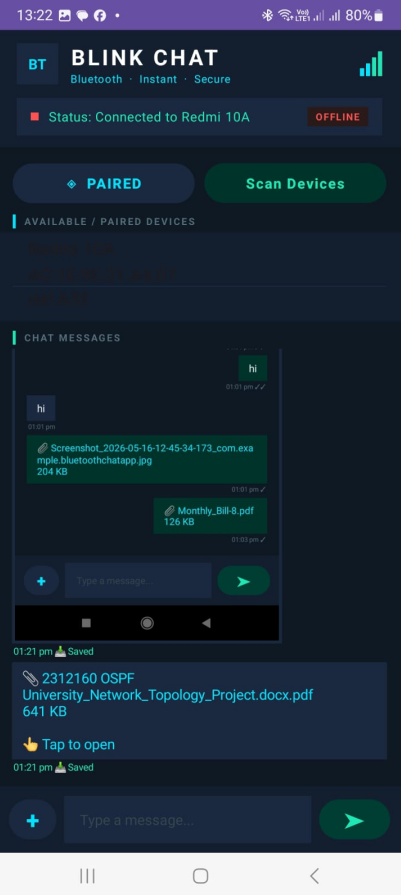

# 🔵 BlinkChat — Bluetooth Chat App

<div align="center">



[](https://android.com)
[](https://kotlinlang.org)
[](https://developer.android.com/guide/topics/connectivity/bluetooth)
[](LICENSE)
[](https://developer.android.com/about/versions/oreo)

**A real-time Bluetooth Classic chat application for Android.**  
Send messages, images, and files between two devices — no internet required.

[Features](#-features) · [Screenshots](#-screenshots) · [How to Run](#-how-to-run) · [Protocol](#-protocol-design) · [Demo](#-demo-video)

</div>

---

## 📋 Table of Contents

- [Overview](#-overview)
- [Features](#-features)
- [Tech Stack](#-tech-stack)
- [Project Structure](#-project-structure)
- [How to Run](#-how-to-run)
- [How to Connect & Chat](#-how-to-connect--chat)
- [Protocol Design](#-protocol-design)
- [Permissions](#-permissions)
- [Demo Video](#-demo-video)
- [Assignment Info](#-assignment-info)

---

## 🌟 Overview

**BlinkChat** is an Android application that enables two devices to communicate directly over **Bluetooth Classic (RFCOMM)** without requiring any internet connection, Wi-Fi, or server infrastructure. It was built as part of the Computer Networks & Data Communications (CNDC) course at SZABIST Islamabad.

The app supports real-time text messaging, image and file transfer with live progress tracking, delivery receipts, auto-reconnection, and a modern dark-themed UI inspired by WhatsApp and iMessage.

---

## ✨ Features

### Core
| Feature | Description |
|---|---|
| 🔍 **Device Discovery** | View paired devices and actively scan for nearby Bluetooth devices |
| 💬 **Real-time Text Chat** | Send and receive messages instantly over RFCOMM |
| 📎 **File Transfer** | Send any file — images, PDFs, documents, ZIP files |
| 📊 **Live Progress Bar** | Real progress indicator during send and receive |
| 🟢 **Connection Status** | Colour-coded status bar — green when connected, grey when offline |
| 🔄 **Auto Reconnect** | Automatically retries connection if the link drops |

### Extra
| Feature | Description |
|---|---|
| 🕐 **Timestamps** | Every message bubble shows the exact send time |
| ✓✓ **Delivery Receipts** | Single tick when sent, double tick when received |
| 🖼️ **Image Thumbnails** | Received images render as previews inside the chat |
| 👆 **Tap to Open** | Received PDFs and files open directly with the system viewer |
| 💾 **Auto Save** | All received files saved to `Downloads/BlinkChat/` automatically |

---

## 🛠 Tech Stack

| Component | Technology |
|---|---|
| Language | Kotlin |
| UI | Android XML Layouts |
| Bluetooth | Android Bluetooth Classic API (RFCOMM) |
| File I/O | MediaStore API (Android 10+), FileProvider |
| Min SDK | API 26 (Android 8.0) |
| Target SDK | API 36 |
| IDE | Android Studio |

---

## 📁 Project Structure

```
BluetoothChatApp/
├── app/
│   └── src/
│       └── main/
│           ├── java/com/example/bluetoothchatapp/
│           │   ├── MainActivity.kt          ← UI + user interactions
│           │   └── BluetoothService.kt      ← Bluetooth protocol engine
│           ├── res/
│           │   ├── layout/
│           │   │   └── activity_main.xml    ← Dark-themed chat UI
│           │   ├── xml/
│           │   │   └── file_paths.xml       ← FileProvider paths
│           │   ├── drawable/
│           │   ├── mipmap/
│           │   └── values/
│           └── AndroidManifest.xml          ← Permissions + providers
│   └── build.gradle.kts
├── gradle/
├── demo/
│   └── demo-video.mp4                       ← Assignment demo video
├── screenshot-1.png                         ← App screenshot
├── PROTOCOL_DESIGN.md                       ← Byte-level protocol document
├── README.md
├── settings.gradle.kts
└── build.gradle.kts
```

---

## 🚀 How to Run

### Prerequisites
- Android Studio **Hedgehog** or newer
- Two Android phones with **Bluetooth Classic** support
- Both phones must have the APK installed

### Step 1 — Clone the Repository
```bash
git clone https://github.com/wahidali-glitch/BluetoothChatApp.git
cd BluetoothChatApp
```

### Step 2 — Open in Android Studio
```
File → Open → Select the BluetoothChatApp folder → Click OK
```

### Step 3 — Build & Install on Both Phones
```
Connect Phone A via USB → Click Run ▶ → Select Phone A
Connect Phone B via USB → Click Run ▶ → Select Phone B
```

### Step 4 — Pair the Phones First
> ⚠️ **Important:** Before launching the app, go to **Settings → Bluetooth** on both phones and pair them with each other.

---

## 💬 How to Connect & Chat

| Step | Phone A | Phone B |
|------|---------|---------|
| 1 | Tap **▶ SERVER** | — |
| 2 | — | Tap **◈ PAIRED** |
| 3 | — | Tap your partner's device name in the list |
| 4 | ✅ Both show **"Connected"** in green | ✅ |
| 5 | Type a message → tap **➤** | Same |
| 6 | Tap **+** → pick any image or file | Same |
| 7 | Watch progress bar fill → file arrives on other phone | Same |

---

## 📡 Protocol Design

See [`PROTOCOL_DESIGN.md`](PROTOCOL_DESIGN.md) for the full byte-level specification.

### Quick Summary

Every packet sent over the RFCOMM socket follows this structure:

```
┌──────────┬──────────────┬──────────────────────────┐
│  1 byte  │   4 bytes    │         N bytes           │
│   TYPE   │   LENGTH     │         PAYLOAD           │
└──────────┴──────────────┴──────────────────────────┘
```

| Type Byte | Name | Payload |
|---|---|---|
| `0x01` | TEXT | UTF-8 message string |
| `0x02` | FILE_INFO | 8-byte file size + UTF-8 file name |
| `0x03` | FILE_CHUNK | Up to 8192 raw bytes |
| `0x04` | FILE_END | Empty (signals end of file) |
| `0x05` | ACK | UTF-8 echo of original message |

`DataInputStream.readFully()` guarantees exact byte delivery — no corruption on large files.

---

## 🔐 Permissions

| Permission | Android Version | Purpose |
|---|---|---|
| `BLUETOOTH_CONNECT` | 12+ (API 31+) | Connect to paired devices |
| `BLUETOOTH_SCAN` | 12+ (API 31+) | Discover nearby devices |
| `BLUETOOTH_ADVERTISE` | 12+ (API 31+) | Make device discoverable |
| `ACCESS_FINE_LOCATION` | Below 12 | Required for BT discovery |

---

## 🎬 Demo Video

A 2–4 minute demo video is available in the [`demo/`](demo/) folder showing:

1. Installing the app on two real Android devices
2. Pairing the devices via Bluetooth settings
3. Establishing a connection through the app
4. Sending and receiving text messages with delivery receipts
5. Transferring an image — rendered as a thumbnail on the receiver
6. Transferring a PDF — saved to Downloads and opened with system viewer

---

## 📚 Assignment Info

| Field | Detail |
|---|---|
| **Course** | Computer Networks & Data Communications (CNDC) |
| **Section** | BSCS-6B |
| **Institute** | Shaheed Zulfikar Ali Bhutto Institute of Science & Technology (SZABIST), Islamabad |
| **Technology Option** | Option C — Native Android (Bluetooth Classic) |
| **Language** | Kotlin |

---

## 👤 Author

**Wahid Ali**  
GitHub: [@wahidali-glitch](https://github.com/wahidali-glitch)

---

<div align="center">

Made with ❤️ for CNDC and Android — SZABIST Islamabad

</div>
